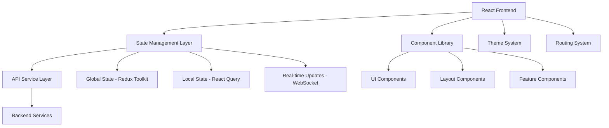

# Design Document

## Overview

The Uniteam web UI is a React-based SaaS application designed for high performance and scalability. The design emphasizes simplicity, accessibility, and efficiency while handling considerable user load. The architecture follows modern React patterns with performance optimizations, state management, and responsive design principles.

## Architecture

### High-Level Architecture



### Technology Stack

- **Frontend Framework**: React 18 with TypeScript
- **State Management**: Redux Toolkit + React Query for server state
- **Styling**: Tailwind CSS with CSS-in-JS for dynamic theming
- **Build Tool**: Vite for fast development and optimized builds
- **Testing**: Jest + React Testing Library
- **Performance**: React.memo, useMemo, useCallback, code splitting
- **Real-time**: WebSocket connection for live updates

## Components and Interfaces

### Core Layout Structure

```
App
├── AppShell
│   ├── Sidebar Navigation
│   ├── Header (User Profile, Notifications, Theme Toggle)
│   └── Main Content Area
├── ChatBot (Floating/Docked)
└── Toast Notifications
```

### Component Hierarchy

#### 1. Navigation Components
- **Sidebar**: Collapsible navigation with role-based menu items
- **MobileNav**: Responsive navigation for mobile devices
- **Breadcrumbs**: Context-aware navigation path

#### 2. Task Management Components
- **TaskList**: Virtualized list for performance with large datasets
- **TaskCard**: Optimized card component with memoization
- **TaskFilters**: Smart filtering with debounced search
- **TaskCalendar**: Calendar view with lazy loading
- **TaskForm**: Inline editing with auto-save functionality

#### 3. Meeting Components
- **MeetingList**: Efficient list rendering with pagination
- **MeetingCard**: Meeting details with attendee avatars
- **MeetingCalendar**: Integrated calendar with drag-and-drop
- **MeetingScheduler**: Smart scheduling with availability checking

#### 4. Project Management Components
- **ProjectDashboard**: Overview with lazy-loaded sections
- **MilestoneTracker**: Progress visualization with charts
- **TeamMemberList**: Efficient member management
- **IssueTracker**: Kanban-style issue management

#### 5. Analytics Components
- **AnalyticsDashboard**: Lazy-loaded charts and metrics
- **ReportGenerator**: On-demand report creation
- **ChartComponents**: Reusable chart library integration

#### 6. ChatBot Components
- **ChatInterface**: Floating/docked chat with message history
- **MessageBubble**: Optimized message rendering
- **ChatInput**: Smart input with suggestions
- **ActionButtons**: Quick action shortcuts

### Performance Optimizations

#### Code Splitting Strategy
```javascript
// Route-based splitting
const TasksPage = lazy(() => import('./pages/TasksPage'));
const MeetingsPage = lazy(() => import('./pages/MeetingsPage'));
const ProjectsPage = lazy(() => import('./pages/ProjectsPage'));
const AnalyticsPage = lazy(() => import('./pages/AnalyticsPage'));

// Component-based splitting for heavy components
const ChatBot = lazy(() => import('./components/ChatBot'));
const AnalyticsCharts = lazy(() => import('./components/AnalyticsCharts'));
```

#### Memoization Strategy
- Use React.memo for pure components
- useMemo for expensive calculations
- useCallback for event handlers passed to child components
- Virtualization for large lists (react-window)

#### State Management Efficiency
- Redux Toolkit for global state with normalized data structure
- React Query for server state with intelligent caching
- Local state for UI-only concerns
- WebSocket integration for real-time updates

## Data Models

### Core Data Structures

#### User Model
```typescript
interface User {
  id: string;
  email: string;
  name: string;
  avatar?: string;
  role: 'user' | 'team_leader' | 'admin';
  preferences: UserPreferences;
  teams: string[];
}

interface UserPreferences {
  theme: 'light' | 'dark' | 'system';
  notifications: NotificationSettings;
  timezone: string;
  language: string;
}
```

#### Task Model
```typescript
interface Task {
  id: string;
  title: string;
  description?: string;
  status: 'pending' | 'in_progress' | 'completed' | 'overdue';
  priority: 'low' | 'medium' | 'high' | 'urgent';
  dueDate?: Date;
  assigneeId: string;
  projectId?: string;
  tags: string[];
  createdAt: Date;
  updatedAt: Date;
}
```

#### Meeting Model
```typescript
interface Meeting {
  id: string;
  title: string;
  description?: string;
  startTime: Date;
  endTime: Date;
  attendees: string[];
  location?: string;
  meetingLink?: string;
  agenda: AgendaItem[];
  projectId?: string;
  createdBy: string;
}
```

#### Project Model
```typescript
interface Project {
  id: string;
  name: string;
  description?: string;
  teamId: string;
  milestones: Milestone[];
  tasks: string[];
  issues: Issue[];
  status: 'planning' | 'active' | 'completed' | 'on_hold';
  createdAt: Date;
  deadline?: Date;
}
```

### State Structure

#### Redux Store Structure
```typescript
interface RootState {
  auth: AuthState;
  ui: UIState;
  tasks: TasksState;
  meetings: MeetingsState;
  projects: ProjectsState;
  teams: TeamsState;
  chat: ChatState;
}
```

#### Normalized Data Pattern
```typescript
interface TasksState {
  entities: Record<string, Task>;
  ids: string[];
  filters: TaskFilters;
  loading: boolean;
  error: string | null;
}
```

## Error Handling

### Error Boundary Strategy
- Global error boundary for unhandled errors
- Feature-specific error boundaries for isolated failures
- Graceful degradation for non-critical features
- User-friendly error messages with recovery options

### API Error Handling
```typescript
interface APIError {
  code: string;
  message: string;
  details?: any;
}

// Centralized error handling
const handleAPIError = (error: APIError) => {
  switch (error.code) {
    case 'NETWORK_ERROR':
      showToast('Connection issue. Please check your internet.');
      break;
    case 'UNAUTHORIZED':
      redirectToLogin();
      break;
    default:
      showToast(error.message);
  }
};
```

### Offline Handling
- Service worker for offline functionality
- Local storage for critical data persistence
- Queue failed requests for retry when online
- Visual indicators for offline state

## Testing Strategy

### Testing Pyramid
1. **Unit Tests**: Individual components and utilities
2. **Integration Tests**: Component interactions and API calls
3. **E2E Tests**: Critical user journeys

### Testing Approach
- Component testing with React Testing Library
- Mock API responses for consistent testing
- Accessibility testing with jest-axe
- Performance testing with React DevTools Profiler

### Test Coverage Goals
- 80%+ code coverage for critical paths
- 100% coverage for utility functions
- Visual regression testing for UI components

## Performance Considerations

### Bundle Optimization
- Tree shaking for unused code elimination
- Dynamic imports for route-based code splitting
- Webpack bundle analyzer for size monitoring
- Compression and minification in production

### Runtime Performance
- Virtual scrolling for large lists
- Image lazy loading and optimization
- Debounced search and filtering
- Memoization of expensive operations
- Web Workers for heavy computations

### Caching Strategy
- HTTP caching for static assets
- React Query for intelligent data caching
- Service worker for offline caching
- Browser storage for user preferences

### Monitoring and Analytics
- Performance monitoring with Web Vitals
- Error tracking and reporting
- User interaction analytics
- Bundle size monitoring

## Accessibility

### WCAG 2.1 AA Compliance
- Semantic HTML structure
- ARIA labels and roles
- Keyboard navigation support
- Screen reader compatibility
- Color contrast compliance
- Focus management

### Accessibility Features
- Skip navigation links
- High contrast mode support
- Reduced motion preferences
- Text scaling support
- Alternative text for images

## Theme System

### Design Tokens
```typescript
interface ThemeTokens {
  colors: {
    primary: ColorScale;
    secondary: ColorScale;
    neutral: ColorScale;
    semantic: SemanticColors;
  };
  typography: TypographyScale;
  spacing: SpacingScale;
  shadows: ShadowScale;
  borderRadius: BorderRadiusScale;
}
```

### Theme Implementation
- CSS custom properties for dynamic theming
- Tailwind CSS configuration with theme tokens
- Smooth theme transitions
- System preference detection
- Theme persistence in local storage

### Dark Theme Considerations
- Appropriate contrast ratios
- Reduced eye strain colors
- Consistent component styling
- Image and icon adaptations

## Responsive Design

### Breakpoint Strategy
```typescript
const breakpoints = {
  sm: '640px',   // Mobile landscape
  md: '768px',   // Tablet portrait
  lg: '1024px',  // Tablet landscape / Small desktop
  xl: '1280px',  // Desktop
  '2xl': '1536px' // Large desktop
};
```

### Mobile-First Approach
- Progressive enhancement from mobile
- Touch-friendly interface elements
- Optimized navigation for small screens
- Gesture support for common actions

### Adaptive Layouts
- Flexible grid systems
- Container queries for component-level responsiveness
- Fluid typography scaling
- Adaptive image sizing

## Security Considerations

### Frontend Security
- XSS prevention with proper sanitization
- CSRF protection with tokens
- Secure authentication token handling
- Content Security Policy implementation

### Data Protection
- Sensitive data encryption in transit
- Secure local storage practices
- User session management
- Privacy-compliant analytics

## Integration Points

### API Integration
- RESTful API with consistent patterns
- GraphQL for complex data fetching
- WebSocket for real-time updates
- Optimistic updates for better UX

### Third-Party Integrations
- Calendar services (Google, Outlook)
- Video conferencing platforms
- File storage services
- Notification services

### ChatBot Integration
- Natural language processing API
- Context-aware conversation handling
- Action execution capabilities
- Help system integration